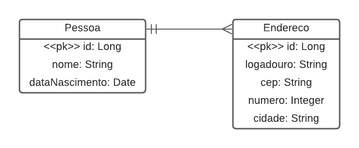

# Avaliação Desenvolvedor Back-end Attornatus

## Desafio Java

Usando Spring boot, crie uma API simples para gerenciar Pessoas. Esta API deve permitir:  
•	Criar uma pessoa
•	Editar uma pessoa
•	Consultar uma pessoa
•	Listar pessoas
•	Criar endereço para pessoa
•	Listar endereços da pessoa
•	Poder informar qual endereço é o principal da pessoa  

Uma Pessoa deve ter os seguintes campos:  
•	Nome
•	Data de nascimento
•	Endereço:
o	Logradouro
o	CEP
o	Número
o	Cidade

Requisitos  
•	Todas as respostas da API devem ser JSON  
•	Banco de dados H2

Diferencial
•	Testes
•	Clean Code
 
Será levado em avaliação 
•	Estrutura, arquitetura e organização do projeto  
•	Boas práticas de programação  
•	Alcance dos objetivos propostos.

## Diagrama ER

